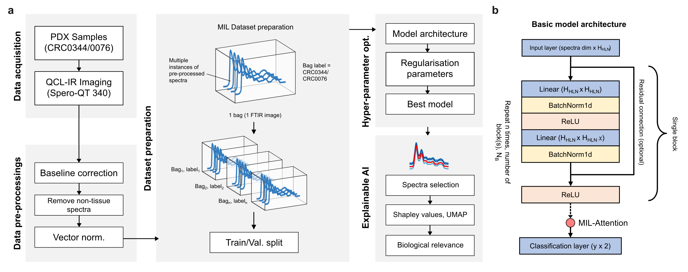

# DREAMER-S: **D**eep Lea**R**ning-**E**nabled **A**ttention-based **M**ultiple-instance approaches with **E**xplainable **R**epresentations for **S**pectral-histopathology

This repository contains the codes necessary to run the hyperparameter optimsition of a ResNet-inspired Linear MIL model (refer figure below). The pre-processing and explainable AI step are not included in this repository.

## ⚙️ Installation and use

### Test run training:

1. We will use a training loop in BiospecML python module, install this module according to the instruction available at: `https://github.com/rafsanlab/BioSpecML`
2. Install other dependencies and modules according to the paper (i.e Pytorch etc.)
3. Clone this repo and run `python run.py`

### For custom training using your own data:

If you have your own data, model, dataset class, training loop or even chosing which parameter to be optimise, follow this step after setting up step 1 and 2 above.

1.  Replace your .mat files in `data/` folder.
2.  Generate two dataframes (train and validation) containg filename column and label column for your data.
3.  Find the mean and std from the training dataset and save as tensor `.pt` file.
4.  Save all the dataframes and tensor `.pt` files in `metadata/` folder.
5.  Edit `run.py` file for your custom parameter and set paths to the prepared files. Also set the label and filename column.
6.  Run `python run.py`.
7.  Training results will be in `results/` folder (will be generate later).

Suggested edits:

- Set custom labels in `labels_dict` for custom dataset.
- Number of epochs (i.e 50, 100).
- Additonal hyperparameter (i.e weight decay, learning rate etc.)
- Your own custom model architecture.
- Your own `training_loop` with custom metrics i.e precision/recall
